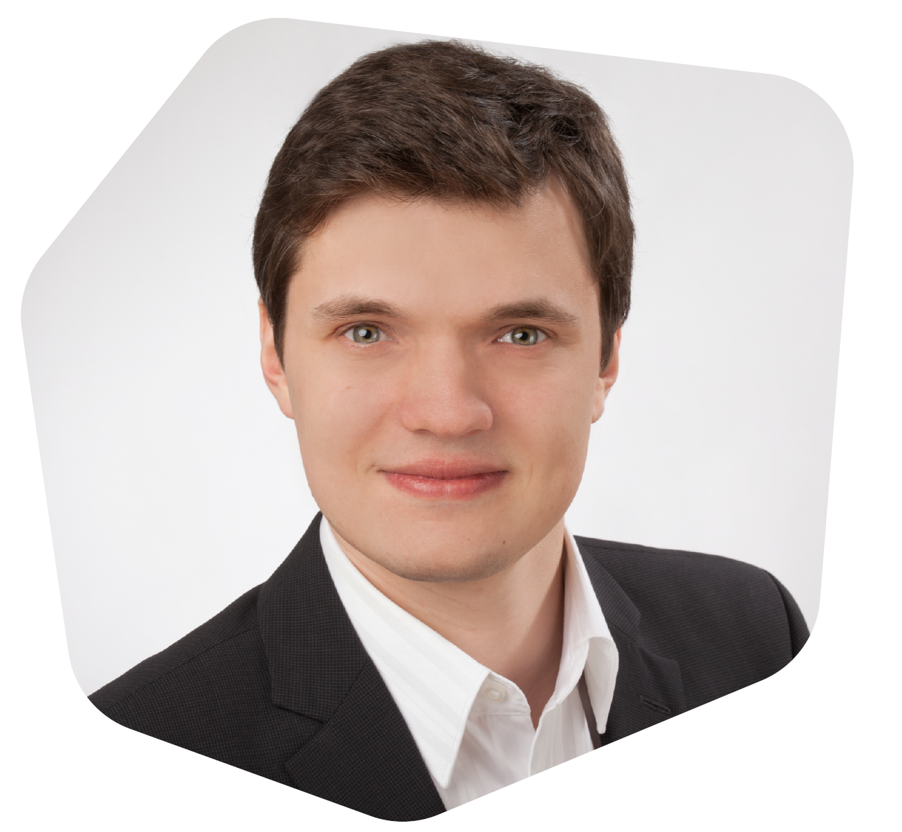

---
hide:
  - navigation
  - toc
---

# Promptathon

- [:material-brain: **Prompting**](content/prompting.md)
- [:material-alpha-a-box-outline: **Arbeitsphase A**](content/A.md)
- [:material-alpha-b-box-outline: **Arbeitsphase B**](content/B.md)
- [:material-link-variant: **Wertvolle Links**](content/links.md)

<!--  -->

??? abstract "Zeitplan für Kursbeginn um 9 Uhr"

    | Zeit        | Programmpunkt                                |
    |-------------:|:----------------------------------------------|
    | 9:00–9:10 | Motivation und Microsoft Copilot             |
    | 9:10–9:30 | Tipps zum Prompt Engineering                 |
    | 9:30–10:00 | Arbeitsphase A                               |
    | 10:00–10:15 | Ergebnissvorstellung und Diskussion          |
    | 10:15–10:30 | **Pause**                                        |
    | 10:30–10:40 | Check-In nach der Pause                      |
    | 10:40–11:30 | Arbeitsphase B                               |
    | 11:30–11:00 | Ergebnisvorstellung und Abschluss            |

??? abstract "Zeitplan für Kursbeginn um 12 Uhr"

    | Zeit        | Programmpunkt                                |
    |-------------:|----------------------------------------------|
    | 12:00–12:10 | Motivation und Microsoft Copilot             |
    | 12:10–12:30 | Tipps zum Prompt Engineering                 |
    | 12:30–13:00 | Arbeitsphase A                               |
    | 13:00–13:15 | Ergebnissvorstellung und Diskussion          |
    | 13:15–13:30 | **Pause**                                        |
    | 13:30–13:40 | Check-In nach der Pause                      |
    | 13:40–14:30 | Arbeitsphase B                               |
    | 14:30–15:00 | Ergebnisvorstellung und Abschluss            |

{ width="300" .center }
/// caption
## Viktor Reichert

<a href="viktor.reichert@qualidy.de" markdown>:octicons-mail-16: viktor.reichert@qualidy.de</a>
///

<!-- [:fontawesome-solid-external-link: Externer Link mit neuen Tab](https://pictogrammers.com/library/mdi/){ target=_blank rel="noopener noreferrer" } -->
<!-- 
{{ youtube_video("https://www.youtube.com/embed/chPCpYNJe_Q?si=frU_Z_VwSGnPWEPF") }}

!!! tip "Schneller Navigieren"

    ++p++ oder ++comma++ : Zur vorherigen Seite gehen (**P**revious)

    ++n++ oder ++period++ : Zur nächsten Seite gehen (**N**ext)
 -->

